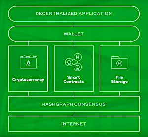
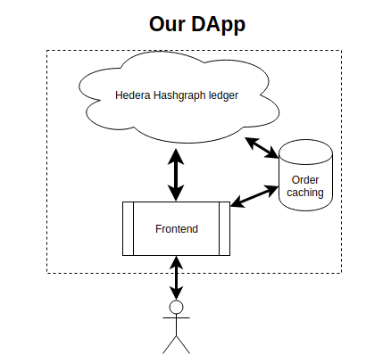
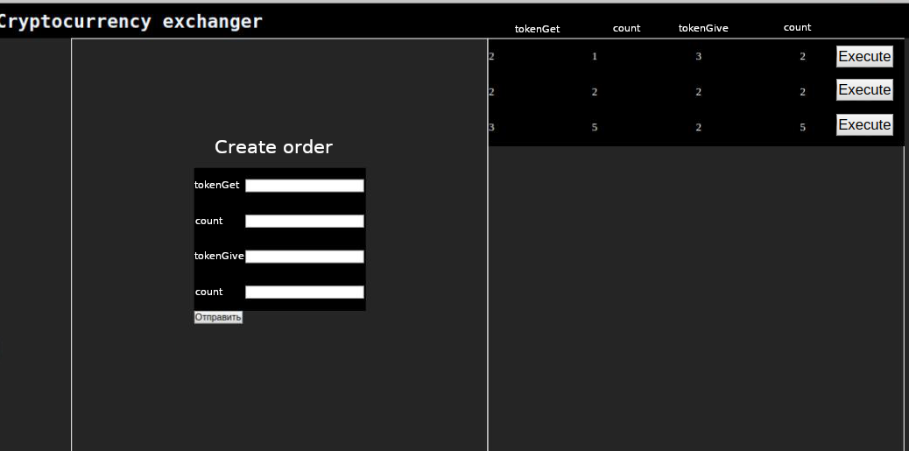

# О разработке DApp на Hedera Hashgraph
Hedera Hashgraph - проект, подлагающий миру распределённый реестр, не являющийся блокчейном. База данных такого реестра строится с помощью цепочек, как в Блокчейне, а в виде ацикличного направленного графа (об этом можно почитать в предыдущей [статье](https://medium.com/xclbrio/how-to-deploy-smart-contracts-on-hedera-hashgraph-network-tutorial-692ab5b0b42e)). Проект на момент написания статьи проходит второй этап тестирования сообществом.

Не смотря на отличие во внутреннем строении от популярных Блокчейн-платформ, проект Hedera Hashgraph включает в себя файловый сервис, смарт-контракты и криптовалюты.



## Криптовалютный сервис
Платформа позволяет выполнять действительно быстрые криптовалютные транзакции между пользователями, длительность переводов исчисляется секундами. Комиссия за транзакции обещается не более цента. Такие особенности позволят в дальнейшем строить системы, основанные на микротранзациях.

Главной криптовалютой, работающей в сети, являются HBar'ы. Деноминация Hbar приведена для ознакомления ниже:
```
gigabar 1 Gℏ = 1,000,000,000 ℏ
megabar 1 Mℏ = 1,000,000 ℏ
kilobar 1 kℏ = 1,000 ℏ
hbar 1 ℏ = 1 ℏ
millibar 1,000 mℏ = 1 ℏ
microbar 1,000,000 μℏ = 1 ℏ
tinybar 100,000,000 tℏ = 1 ℏ
```

## Сервис смарт-контрактов

Меня с самого начала проект заинтересовал именно как платформа для DApp. Backend-составляющая децентрализованных приложений должна находиться внутри децентрализованной пиринговой сети. Логическая часть приложения, конкретно сам исполняемый программный код описывается с помощью смарт-контрактов.

Взаимодействие со смарт-контрактами происходит через собственный API платформы (например, как web3 для Ethereum), ознакомиться с ним можно на [официльном репозитории](https://github.com/hashgraph/hedera). На момент мая 2019 года разработчикам ещё недоступны ноды (mirror nodes) сети. Взаимодействие по сети с существующими подсетями платформы осуществляется с помощью google protobuf. Для разработки DApp существуют SDK на языках [Java](https://github.com/hashgraph/hedera-sdk-java) (поддерживается официально), [C](https://github.com/launchbadge/hedera-sdk-c), [Rust](https://github.com/launchbadge/hedera-sdk-rust), [Python](https://github.com/launchbadge/hedera-sdk-python), [GO](https://github.com/launchbadge/hedera-sdk-go)  (поддерживаются сообществом).

Для смарт-контрактов Hedera используется язык Solidity, присутствует поддержка ERC-20/ERC-721-токенов. 

## Разработка DApp

Далее хочу описать собственный опыт взаимодействия с платформой и подводные камни, который встретились мне в процессе разработки.

Итак, я задался целью разработать своё первое приложение на Hedera Hashgraph.
Моим проектом будет криптовалютный обменник, в котором пользователи смогут обмениваться ERC-20 токенами и Hbarами. Такое приложение несложно в реализации на стороне смарт-контрактов. обозначим функционал и алгоритм в целом.



В нашем обменнике пользователь сможет:
1) Создать одрер на обмен одной криптовалюты на другую;
2) Исполнить уже существующий одрер;
3) Отменить собственный ордер.

У пользователя для работы с обменником будет собственный кошёлёк. Таким образом, сюда добавятся функции:

4) Ввод ERC20/Hbar-токенов на личный счёт обменника;

5) Вывод ERC20/Hbar-токенов из личного счёта.

- Для хранения счёта пользователя у нас будет mapping с ключами [userAddress][token]. 
- Для взаимодействия с криптовалютой (пункты 4,5) будут реализованы соответсвующие методы ввода/вывода. 
- Логика взаимодействия с ордерами также нетривиальна: пользователь вызывает функцию создания ордера, передавая (tokenGet, amountGet, tokenGive, amountGive) в метод. Для исполнения ордера необходимо указать уникальное значение ордера либо через заранее сгенерированный hash по его полям, либо через позицию в массиве (для простоты эксперимента я взял последний вариант, однако рекомендую первый).

Отлично, код смарт-контракта написан и протестирован. Как задеплоить контракт в Hedera Hashgraph?
Воспользуемся Hedera SDK for Rust. Разберём подробно последовательность действий для деплоя SC:

1) Сгенерировать ABI для вызова методов и байткод контракта. Для разработки SC я использую Truffle, для генерации выполняю команду truffle build.
2) Загрузить байт-код контракта на платформу HH как .bin файл (см. create_file_from_file.rs). ВАЖНО! У файлового сервиса Hedera Hashgraph существует ограничение веса файлов в 6кб (ранее было заявлено 4кб, на практике оказалось другое значение). Учтите данное ограничение, очень часто вес байткода получается больше заданного лимита. В таком случае платформа позволяет загружать файл по частям (см. append_file.rs).
В случае успеха ответом сервиса будет номер файла (например, 0.0.1035).
3) Создать смарт-контракт, ссылаясь на номер файла с байткодом, уже находящегося в сети (см. create_contract.rs в ветке репозитория example/create_run_contract). В случае успеха возвращается номер смарт-контракта (например, 0.0.1536).

В дальнейшем при вызове методов SC ссылаться будем именно на его номер. Вызов функций можно изучить на примере call_hello_world_contract.rs в ветке [example/create_run_contract](https://github.com/launchbadge/hedera-sdk-rust/tree/example/create_run_contract). В транзакции помимо данных аккаунта и ноды указывается число передаваемых hbar, имя вызываемой функции, её аргументы.

Вот так выглядит прототип моего DApp:


